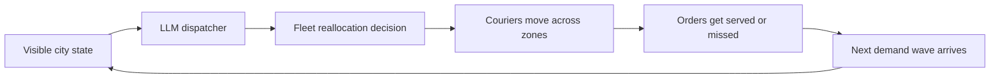

# Fleetmind

**Can an AI run a city's delivery fleet when tomorrow's demand is hidden?**

**Fleetmind is a benchmark for real-world orchestration.**

Fleetmind is a delivery benchmark for long-horizon decision making under uncertainty. An agent sees the current city state: active zones, visible demand, courier availability, and local congestion. It must decide how to rebalance the fleet before the next wave of demand arrives.

That is the core tension:
- the agent must reason from partial signals
- the environment reveals demand round by round
- the benchmark measures whether the fleet was positioned well over time

This makes Fleetmind a benchmark about anticipation, not just reaction.

## Real-World Orchestrator

Fleetmind is designed around a simple but important question:

**Can an LLM behave like a real operational orchestrator instead of just a reactive assistant?**

In Fleetmind, the model is not answering a static question. It is:
- allocating scarce courier capacity
- reacting to shifting demand
- balancing immediate service against future positioning
- operating under uncertainty the way real dispatch systems do

That framing is a big part of what makes the benchmark compelling.

## Visual Overview



## Why Fleetmind Is Interesting

Most agent benchmarks reward good local moves. Fleetmind is designed to reward good positioning.

The hard part is not clicking the obvious best action right now. The hard part is deciding:
- whether a current spike is real demand or a decoy
- which zones deserve extra courier coverage before the evidence is obvious
- when to preserve flexibility instead of overcommitting
- how to trade immediate service against future coverage

In other words: the agent sees the city, but not the future.

## What We Built

Fleetmind V3 is a fully playable OpenEnv-style benchmark with:
- a clean `reset / state / step` API
- public task tiers:
  - `easy_dispatch`
  - `medium_dispatch`
  - `hard_dispatch`
- hidden curated case banks behind public seeds
- deterministic graded episodes
- deterministic validation and Docker packaging
- a live Hugging Face Space deployment

Submission-facing shell:
- [app.py](/C:/Users/risha/Documents/New project/app.py)
- [openenv.yaml](/C:/Users/risha/Documents/New project/openenv.yaml)
- [inference.py](/C:/Users/risha/Documents/New project/inference.py)
- [validate_submission.py](/C:/Users/risha/Documents/New project/validate_submission.py)

Core benchmark implementation:
- [api.py](/C:/Users/risha/Documents/New project/src/delivery_dispatch_v3/api.py)
- [environment.py](/C:/Users/risha/Documents/New project/src/delivery_dispatch_v3/environment.py)
- [generator.py](/C:/Users/risha/Documents/New project/src/delivery_dispatch_v3/generator.py)
- [solver.py](/C:/Users/risha/Documents/New project/src/delivery_dispatch_v3/solver.py)
- [grading.py](/C:/Users/risha/Documents/New project/src/delivery_dispatch_v3/grading.py)
- [seed_catalog.py](/C:/Users/risha/Documents/New project/src/delivery_dispatch_v3/seed_catalog.py)

## The Benchmark Design

Fleetmind uses a delivery-domain benchmark family with:
- `K` delivery zones
- `M` couriers
- `T` decision rounds
- visible current demand by zone
- hidden future demand patterns
- optional congestion and premium windows

At each round, the agent chooses a target courier allocation across zones.

The agent sees:
- current visible orders
- per-order rewards
- congestion multipliers
- courier counts by zone
- remaining rounds

This lets us build tasks that are:
- hard for the agent
- practical to evaluate at benchmark scale

That was a central design goal.

## Why It Feels Different

Fleetmind is not trying to be a flashy simulator.

It is intentionally shaped around a realistic orchestration loop:
- observe the city
- move capacity
- live with the downstream consequences
- adapt on the next round

That means success depends on operational judgment, not just finding a locally attractive move.

## Difficulty Tiers

Fleetmind keeps the interface simple, and scales difficulty through hidden structure rather than simulator clutter.

### Easy
- visible demand is fairly informative
- sensible rebalancing works reasonably well
- strong one-shot policies can do well

### Medium
- current demand starts to mislead
- short-term greed leaves value on the table
- repositioning becomes strategically important

### Hard
- future demand stays ambiguous for longer
- overcommitting early creates downstream regret
- the agent must hedge, infer, and adapt over time

## Public API

Endpoints:
- `GET /health`
- `POST /reset`
- `GET /state`
- `POST /step`

`POST /reset` behavior:
- with `task_id`, starts a fresh episode in that tier
- with `seed`, deterministically maps the public seed to a hidden curated case
- with no `seed`, randomly selects a hidden curated case
- with no `task_id`, randomly chooses one of the public tasks

The observation includes:
- `task_id`
- `round_index`
- `remaining_rounds`
- per-zone courier and demand state
- feedback from the last step
- `scenario_info` with fleet limits and episode hints

Example action format:

```json
{
  "target_allocations": [
    {"zone_id": "north", "courier_count": 2},
    {"zone_id": "east", "courier_count": 1},
    {"zone_id": "south", "courier_count": 1},
    {"zone_id": "west", "courier_count": 2}
  ]
}
```

Rules:
- include every zone exactly once
- counts must sum to the total courier count
- invalid or over-cap rebalances are penalized and ignored

## Live Demo

Hugging Face Space:
- [rishavutk/fleetmind](https://huggingface.co/spaces/rishavutk/fleetmind)

Health endpoint:
- [Space health](https://rishavutk-fleetmind.hf.space/health)

## Try It

If you want to explore Fleetmind through the codebase or the live Space, the main entrypoints are:
- [app.py](/C:/Users/risha/Documents/New project/app.py)
- [inference.py](/C:/Users/risha/Documents/New project/inference.py)
- [openenv.yaml](/C:/Users/risha/Documents/New project/openenv.yaml)
- [validate_submission.py](/C:/Users/risha/Documents/New project/validate_submission.py)

The benchmark exposes a simple episode loop:
- `reset`
- `state`
- `step`

That makes it easy to plug in:
- LLM agents
- scripted heuristics
- black-box evaluation agents
- external orchestrator policies

## Why It Matters

A lot of real work does not look like question answering. It looks like:
- monitoring a changing system
- reallocating limited resources
- acting before the full picture is visible
- absorbing the cost of bad early decisions

Fleetmind brings that style of decision making into a compact benchmark loop.

## Project Map

Important files:
- [README.md](/C:/Users/risha/Documents/New project/README.md)
- [HACKATHON_REQUIREMENTS.md](/C:/Users/risha/Documents/New project/HACKATHON_REQUIREMENTS.md)
- [PROJECT_SPEC.md](/C:/Users/risha/Documents/New project/PROJECT_SPEC.md)
- [src/delivery_dispatch_v3](/C:/Users/risha/Documents/New project/src/delivery_dispatch_v3)
- [docs/v3_blackbox_subagent_contract.md](/C:/Users/risha/Documents/New project/docs/v3_blackbox_subagent_contract.md)

## What Makes It Cool

Fleetmind is not just "delivery dispatch with JSON."

It turns delivery operations into an agent benchmark where the model has to think like a dispatcher:
- where should capacity move before demand becomes obvious?
- which signals are real and which are decoys?
- when is it better to hedge than to commit?

That makes Fleetmind a benchmark for real-world orchestration behavior, not just single-step response quality.
