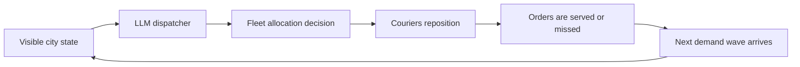

# Fleetmind

**Can an LLM coordinate a city's delivery fleet when the future is hidden?**

Fleetmind is a benchmark for real-world orchestration. An agent sees a living city state: visible orders, courier supply, local congestion, and limited time. It must decide how to reposition the fleet before the next demand wave arrives.

This is not a QA task and it is not a one-step game. Fleetmind asks a model to behave like an operational dispatcher:
- move scarce capacity before the signal is obvious
- decide when a demand spike is real or a decoy
- absorb the cost of early mistakes over multiple rounds
- trade short-term service against future coverage

## Why Fleetmind Feels Different

Most agent benchmarks reward the best local move. Fleetmind is built to reward good positioning.

The agent never gets the whole picture. It only sees the current city. The interesting behavior comes from how it allocates couriers under uncertainty, how it responds to shifting pressure, and whether it learns to treat operations as a long-horizon control problem instead of a reactive chatbot problem.

That makes Fleetmind a benchmark for:
- orchestration
- anticipation
- resource allocation
- decision making under partial information

## The Core Loop



## What the Agent Is Actually Doing

A Fleetmind player is not answering prompts in isolation. It is repeatedly making operational calls:

1. inspect the current state of the city
2. decide how many couriers each zone should hold
3. pay the cost of moving too early, too late, or in the wrong direction
4. adapt as the city evolves

That structure is intentionally close to real dispatch and orchestration work. The benchmark is compact, but the reasoning pattern is real.

## Difficulty Tiers

Fleetmind exposes three public task tiers:
- `easy_dispatch`
- `medium_dispatch`
- `hard_dispatch`

The interface stays simple across all three. Difficulty comes from how misleading the visible signal is and how costly bad positioning becomes over time.

### Easy
- visible demand is fairly informative
- straightforward repositioning can work well
- a competent one-shot policy can succeed

### Medium
- local demand becomes less trustworthy
- reactive play starts leaving value behind
- better timing and positioning matter more

### Hard
- the future stays ambiguous for longer
- naive chasing gets punished
- strong play requires hedging, inference, and adaptation over multiple rounds

## Why This Matters

A lot of real work does not look like answering a question. It looks like:
- watching a changing system
- reallocating limited resources
- acting before the full picture is visible
- living with the downstream cost of early decisions

Fleetmind turns that style of work into a benchmark an LLM can actually play.

## What We Built

Fleetmind V3 is a fully playable OpenEnv-style environment with:
- a clean `reset / state / step` interface
- public task tiers with hidden curated cases behind the scenes
- deterministic episode flow and grading
- a live Hugging Face Space deployment
- a submission-ready root shell for automated evaluation

Submission-facing shell:
- [app.py](/C:/Users/risha/Documents/New project/app.py)
- [openenv.yaml](/C:/Users/risha/Documents/New project/openenv.yaml)
- [inference.py](/C:/Users/risha/Documents/New project/inference.py)
- [validate_submission.py](/C:/Users/risha/Documents/New project/validate_submission.py)

Core benchmark code:
- [api.py](/C:/Users/risha/Documents/New project/src/delivery_dispatch_v3/api.py)
- [environment.py](/C:/Users/risha/Documents/New project/src/delivery_dispatch_v3/environment.py)
- [generator.py](/C:/Users/risha/Documents/New project/src/delivery_dispatch_v3/generator.py)
- [grading.py](/C:/Users/risha/Documents/New project/src/delivery_dispatch_v3/grading.py)
- [seed_catalog.py](/C:/Users/risha/Documents/New project/src/delivery_dispatch_v3/seed_catalog.py)

## What an Episode Looks Like

Each episode unfolds as a compact operational loop:
- the environment returns the current state of all zones
- the agent proposes a target courier allocation
- the fleet moves, demand resolves, and the next round begins
- reward accumulates over the episode
- `done=true` ends the episode and returns the final summary

The action format is intentionally simple:

```json
{
  "target_allocations": [
    {"zone_id": "north", "courier_count": 2},
    {"zone_id": "east", "courier_count": 1},
    {"zone_id": "south", "courier_count": 1},
    {"zone_id": "west", "courier_count": 2}
  ]
}
```

## Public API

Endpoints:
- `GET /health`
- `POST /reset`
- `GET /state`
- `POST /step`

`POST /reset` can:
- start a fresh episode for a specific tier
- use a public seed for deterministic replay
- generate a fresh hidden case when no seed is provided
- choose a random tier when no task id is provided

The observation includes:
- `task_id`
- current round state
- remaining rounds
- per-zone demand and courier counts
- feedback from the last action
- `scenario_info` with episode limits and hints

## Live Benchmark

Hugging Face Space:
- [rishavutk/fleetmind](https://huggingface.co/spaces/rishavutk/fleetmind)

Health endpoint:
- [rishavutk-fleetmind.hf.space/health](https://rishavutk-fleetmind.hf.space/health)

## Benchmark Story

The most interesting part of Fleetmind is not the surface JSON. It is the behavior it asks from the model.

A good Fleetmind policy has to answer questions like:
- should I move capacity now or preserve flexibility?
- is this local spike the beginning of a real shift or just a decoy?
- which zones deserve protection before demand fully materializes?
- when does waiting become more dangerous than moving?

That is why we think Fleetmind is a compelling benchmark for orchestration-heavy LLM behavior.

## Project Map

Useful entry points:
- [README.md](/C:/Users/risha/Documents/New project/README.md)
- [HACKATHON_REQUIREMENTS.md](/C:/Users/risha/Documents/New project/HACKATHON_REQUIREMENTS.md)
- [PROJECT_SPEC.md](/C:/Users/risha/Documents/New project/PROJECT_SPEC.md)
- [docs/v3_blackbox_subagent_contract.md](/C:/Users/risha/Documents/New project/docs/v3_blackbox_subagent_contract.md)
- [src/delivery_dispatch_v3](/C:/Users/risha/Documents/New project/src/delivery_dispatch_v3)

## One-Line Pitch

**Fleetmind evaluates whether an LLM can stop acting like a chatbot and start acting like a real delivery orchestrator.**
